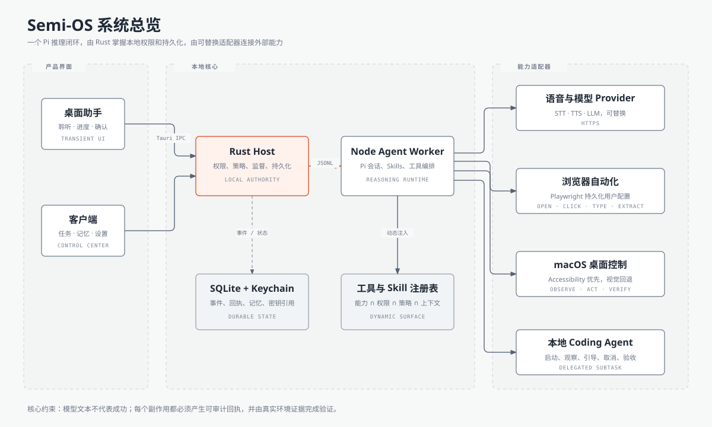
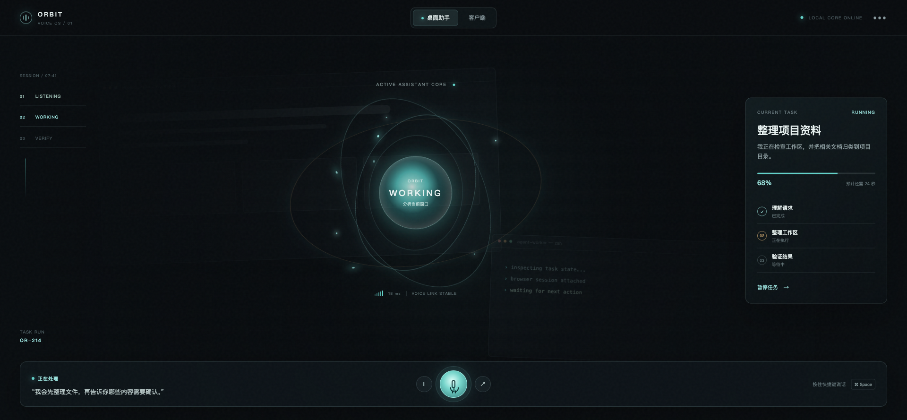
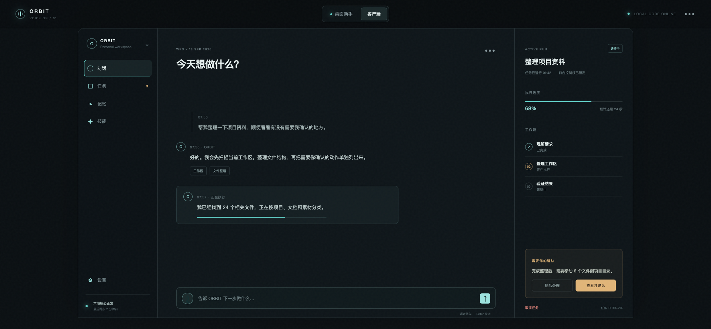
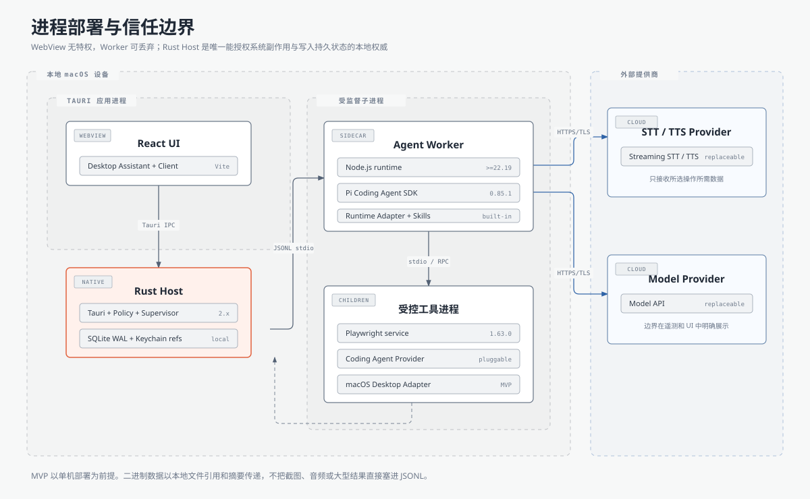
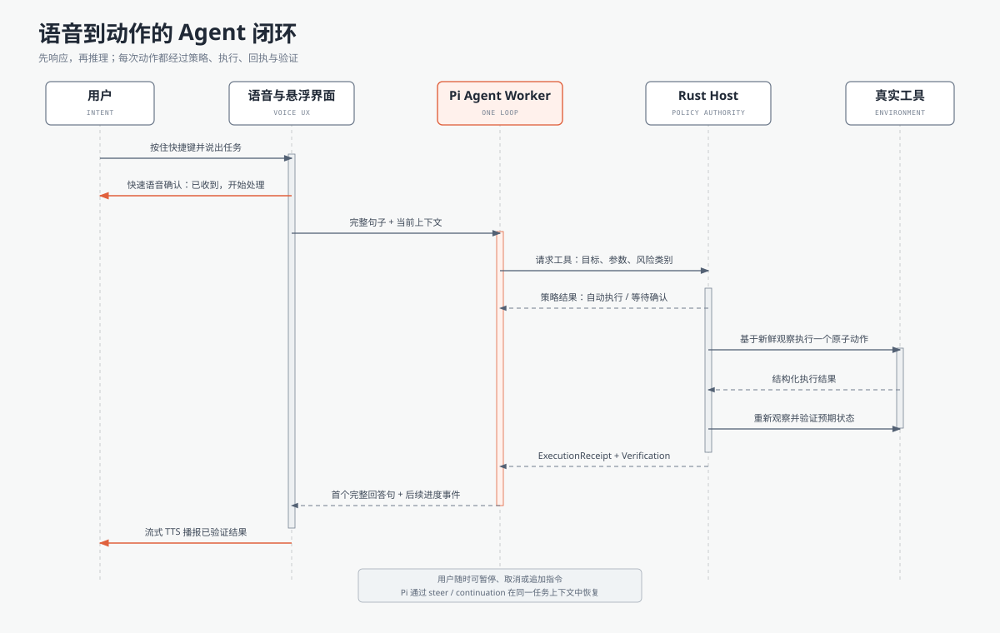
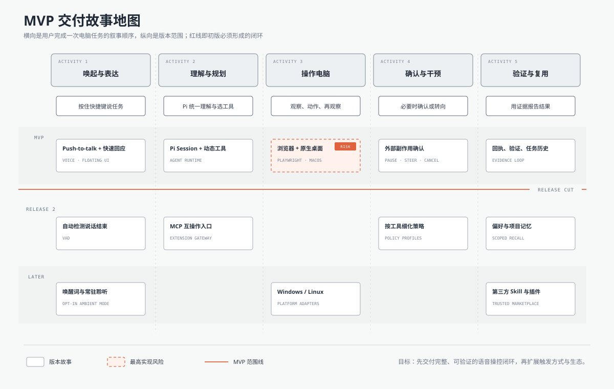

# Semi-OS Detailed Design

> Version: v0.1
>
> Date: 2026-09-14
>
> Stage: architecture baseline, before implementation
>
> Audience: product owner, desktop engineers, agent-runtime engineers and contributors

## Executive summary

Semi-OS is a local-first, voice-first desktop agent. Its core promise is not
“talk to an AI”, but “speak an intention and let the system safely operate the
computer until the result is verified”.

The MVP supports two representative task families:

1. General computer work: open a site, collect information, edit local files,
   operate a macOS application and prepare or submit an external action.
2. Coding work: delegate a repository task to a local coding agent, monitor its
   progress, interrupt or steer it, and report the verified outcome.

The proposed runtime is `Tauri + React + Rust Host + supervised Node Agent
Worker`. Pi is embedded through an adapter and remains the unified reasoning
loop. Rust owns privileged operating-system access and durable local state.
Tools are exposed dynamically according to platform capability, user policy,
task context and current permission state.



## 1. Product boundaries

### 1.1 What the MVP must prove

The first release succeeds when a user can:

- hold a shortcut, speak a task and hear an acknowledgement quickly;
- see a minimal floating assistant while the task is active;
- let the agent use browser, native desktop and coding tools;
- interrupt with a new instruction without losing the task context;
- approve or reject external side effects;
- recover from ordinary process/network failures;
- receive a voice summary grounded in execution evidence;
- benefit from remembered preferences and prior task context.

### 1.2 What the MVP is not

- It is not a fully autonomous background operator.
- It is not a universal cross-platform automation engine on day one.
- It is not a plugin marketplace.
- It does not treat screenshots as the only desktop control surface.
- It does not expose raw chain-of-thought or every internal tool call.
- It does not claim success from an assistant sentence without verification.

### 1.3 Experience surfaces

The experience intentionally has two surfaces:

- **Desktop assistant:** transient, ambient and voice-first. It appears while
  listening, working or waiting for confirmation.
- **Client:** persistent control center for conversation, task history, memory,
  skills, permissions and settings.





The prototype uses an earlier temporary label. `Semi-OS` is the repository and
working product name; visual identity and micro-interactions remain adjustable.

## 2. Architecture principles

### 2.1 Local-first authority

Task history, memory, policy, receipts and user settings live locally by
default. Cloud STT, TTS and LLM providers receive only the data required for the
selected operation. Provider boundaries must be explicit in telemetry and UI.

### 2.2 One reasoning loop

All meaningful user tasks enter the Pi-backed agent session. Deterministic code
may normalize input, enforce policy and execute tools, but it must not create a
second hidden “simple agent” that bypasses Pi. This keeps tool investment,
steering, memory injection and task history relevant to every workflow.

### 2.3 Privilege separation

The webview cannot directly run shell commands, access secrets, write SQLite or
drive macOS accessibility APIs. It sends typed commands to the Rust host. The
Node worker cannot grant itself capabilities; privileged requests return to
Rust for policy enforcement and execution.

### 2.4 Evidence before completion

Each action returns an `ExecutionReceipt`. The task finalizer requires
appropriate evidence for the task class:

- browser: URL/DOM state, extracted content, download or network result;
- desktop: focused window, accessibility state, screenshot diff or app state;
- coding: exit status, changed files, diagnostics and tests;
- external side effect: provider identifier, remote object ID or reconciliation.

### 2.5 Replaceable edges

Volatile dependencies sit behind interfaces:

- `AgentRuntimeAdapter` for Pi;
- `SpeechToTextProvider` and `TextToSpeechProvider`;
- `BrowserAutomationProvider`;
- `DesktopAutomationProvider`;
- `EmbeddingProvider` and `MemoryStore`;
- future `McpGateway`.

## 3. Process architecture



### 3.1 React UI

Responsibilities:

- render desktop assistant and client windows;
- capture push-to-talk intent and display live state;
- submit user decisions for confirmation requests;
- render domain events, not infer state from assistant prose;
- never hold provider secrets or execute privileged actions.

Recommended frontend stack:

- React + TypeScript + Vite;
- a small state machine/store for UI projections;
- Tauri event/command APIs;
- Canvas/WebGL only for the dynamic assistant core, isolated from business UI.

### 3.2 Rust host

Rust is the local authority and supervisor:

- app lifecycle, tray, windows and global shortcut;
- microphone and macOS permission checks;
- Keychain-backed secret references;
- SQLite connection, migrations and transaction boundaries;
- native desktop observation/action adapters;
- policy enforcement for privileged tool calls;
- spawn, monitor and restart the Node worker;
- map worker events onto Tauri events;
- redact and persist structured telemetry.

### 3.3 Node agent worker

The worker owns reasoning-oriented orchestration:

- instantiate the Pi session through `AgentRuntimeAdapter`;
- stream model events and translate them into domain events;
- build the dynamic tool set for each task/turn;
- match built-in skills and inject selected resources;
- coordinate STT/TTS providers;
- manage pause, abort, steer, follow-up and compaction;
- call Rust-owned privileged tools over a narrow RPC boundary;
- supervise browser and coding-agent subprocesses.

The worker is disposable. After restart, it rebuilds state from SQLite,
persisted Pi session data and task checkpoints.

### 3.4 Communication

Use three typed channels:

| Channel | Transport | Purpose |
| --- | --- | --- |
| React ↔ Rust | Tauri commands/events | UI intent and domain event stream |
| Rust ↔ Node | local JSONL RPC over stdio | supervised control and privileged tool bridge |
| Node ↔ child tool | process-specific stdio/RPC | Playwright service, coding agent, future adapters |

JSONL records carry `protocolVersion`, `requestId`, `taskId`, `kind`, `payload`
and optional `traceId`. Unknown message versions fail closed. Large binary data
is passed by local file reference plus digest, not embedded in JSON.

## 4. Agent runtime and control loop

The current verified Pi package is `@earendil-works/pi-coding-agent`. Its SDK
supports embedded sessions, event subscription, `steer`, `followUp`, `abort`,
dynamic tool replacement and extensions. Semi-OS should use the SDK first and
keep Pi behind an adapter rather than editing Pi internals immediately.



### 4.1 Adapter contract

```ts
interface AgentRuntimeAdapter {
  startSession(input: StartSessionInput): Promise<AgentSessionHandle>;
  prompt(input: AgentPrompt): Promise<void>;
  steer(input: AgentSteering): Promise<void>;
  followUp(input: AgentFollowUp): Promise<void>;
  pause(taskId: string): Promise<PauseResult>;
  abort(taskId: string): Promise<void>;
  replaceTools(tools: AgentToolDescriptor[]): Promise<void>;
  subscribe(listener: (event: AgentRuntimeEvent) => void): Unsubscribe;
  checkpoint(): Promise<AgentCheckpoint>;
  dispose(): Promise<void>;
}
```

`pause` is a Semi-OS semantic operation. Depending on the active phase it may:

- stop audio/TTS immediately;
- abort an in-flight model request;
- request cooperative cancellation from the active tool;
- preserve the last completed receipt and Pi session branch;
- transition the task to `paused`;
- on resume, inject a short continuation context and any new user instruction.

### 4.2 Dynamic tool injection

The available tool set is the intersection of:

```text
built-in catalog
∩ platform support
∩ granted OS permissions
∩ user policy
∩ task workspace
∩ runtime health
∩ active skill requirements
```

Pi built-ins such as file reading/writing and shell execution should not be
duplicated without a policy reason. Semi-OS adds tools Pi does not natively own:

- browser: `browser_open`, `browser_click`, `browser_type`, `browser_extract`;
- desktop: `desktop_observe`, `desktop_click`, `desktop_type`, `desktop_key`,
  `desktop_scroll`, `desktop_focus_window`, `desktop_launch_app`;
- confirmation: internal policy-controlled approval requests;
- coding delegation: start/observe/steer/cancel a local coding-agent task;
- memory: scoped recall and explicit memory proposals.

### 4.3 Skills

A Skill is declarative guidance plus optional scripts/resources. MVP Skills are
built in and signed with the app release. Selection uses:

1. deterministic candidate matching from intent, app, domain and tool needs;
2. injection of a compact candidate list;
3. final selection by the agent;
4. loading only the selected Skill’s detailed instructions and resources.

This avoids injecting the complete skill library into every prompt. Pi’s native
resource loader and extension hooks are preferred; a Semi-OS `SkillRegistry`
adds metadata, trust and compatibility rules around them.

## 5. Voice architecture

### 5.1 Pipeline

```text
push-to-talk
→ capture/denoise
→ streaming STT
→ final utterance
→ immediate acknowledgement
→ Pi prompt
→ first complete answer sentence
→ streaming TTS
→ continued task progress
```

MVP waits for the first complete user sentence before sending the task to the
agent. Automatic voice-activity detection and wake word remain extension
branches.

### 5.2 Latency strategy

Latency is not dominated by Pi alone. Measure separate budgets:

| Segment | Target experience |
| --- | --- |
| Hotkey to listening indicator | effectively immediate |
| Speech end to acknowledgement | under about 500 ms when provider permits |
| Acknowledgement to visible plan/progress | stream as soon as available |
| First complete assistant sentence to audio | begin TTS immediately |
| Tool progress | emit structured milestones, not silent waiting |

The acknowledgement is deterministic and must not claim task completion. TTS
uses sentence buffering so the user hears coherent speech without waiting for
the entire answer.

### 5.3 Provider interfaces

Cloud-first providers accelerate MVP quality, but all provider-specific events
are normalized. Local Whisper-family STT and local TTS can be added later
without changing task orchestration. Secrets remain in Keychain; the worker
receives short-lived credentials or opaque provider handles where practical.

## 6. Tool architecture

### 6.1 Common tool contract

```ts
interface ToolDefinition<I, O> {
  id: string;
  version: string;
  risk: "read" | "local_write" | "external_side_effect" | "privileged";
  availability(ctx: ToolContext): Availability;
  summarize(input: I, ctx: ToolContext): ActionSummary;
  execute(input: I, ctx: ToolContext, signal: AbortSignal): Promise<O>;
  verify?(input: I, output: O, ctx: ToolContext): Promise<Verification>;
  reconcile?(input: I, attempt: AttemptRecord): Promise<Reconciliation>;
}
```

Every invocation records sanitized input, target, policy decision, approval
digest, timing, result class, verification and artifacts.

### 6.2 Browser automation

MVP uses Playwright with a Semi-OS-owned persistent browser profile:

- the user signs in interactively once;
- cookies/storage never enter Git and are treated as secrets;
- prefer role/name/label/text locators over brittle coordinates;
- expose four stable primitives first: open, click, type and extract;
- expand navigation/download/upload only when real scenarios require them;
- re-observe after every state-changing action.

Playwright’s authenticated state can contain impersonation-capable cookies, so
profile data must stay in the user data directory with restrictive permissions.

### 6.3 Native desktop automation

macOS MVP uses Accessibility APIs for semantic observation and actions.
Screen capture plus vision is a fallback for surfaces without useful semantics.

Each desktop step follows:

1. observe the active application/window;
2. resolve one target semantically, visually if necessary;
3. execute exactly one atomic action;
4. observe again;
5. verify expected state or return a structured mismatch.

The agent cannot submit an opaque multi-action script to the desktop driver.
Scripts may exist inside trusted Skills, but privileged actions still cross the
same per-action policy and receipt boundary.

### 6.4 Coding-agent delegation

Coding work is a tool-backed subtask, not a second product mode. The adapter
must support:

- start with repository, objective and constraints;
- stream milestones and changed-file summaries;
- inject steering;
- cancel/pause cooperatively;
- collect exit state, diff, tests and diagnostics;
- prevent the child from bypassing Semi-OS confirmation policy for external
  side effects.

The initial implementation may invoke an installed local agent. Later,
different coding agents can be registered behind `CodingAgentProvider`.

## 7. Policy, confirmation and security

### 7.1 Default risk policy

| Risk class | Examples | MVP default |
| --- | --- | --- |
| `read` | inspect files, DOM, accessibility tree | automatic |
| `local_write` | edit local file, create local artifact | automatic |
| `external_side_effect` | send message, submit form, publish, purchase | confirm |
| `privileged` | install software, permission/security changes | confirm |

Settings may make low-risk actions stricter. High-risk tools default to
confirmation. The product must clearly warn when a user weakens policy.

### 7.2 Approval binding

An approval is valid only for:

- `taskId`;
- tool ID and version;
- normalized target identity;
- human-readable summary;
- canonical payload digest;
- expiry time.

Any target or payload change invalidates approval and requests a new one.

### 7.3 Unknown outcomes

If a network disconnect happens before execution, limited retry is allowed. If
it happens after a request may have reached an external system:

1. mark the attempt `unknown`;
2. stop automatic retry;
3. run tool-specific reconciliation using idempotency key, remote search or
   state readback;
4. classify as `succeeded`, `failed` or `needs_user`;
5. explain uncertainty plainly.

### 7.4 First-run permission center

The client checks microphone, Accessibility and Screen Recording permission.
Missing permission disables only dependent capabilities. The UI explains the
reason and opens the relevant System Settings page.

## 8. Task model and recovery

### 8.1 State machine

```text
created → listening → understanding → running
                               ↘ waiting_confirmation
running ↔ paused
running → verifying → completed
running → unknown → reconciling → completed | failed | needs_user
any active state → cancelling → cancelled
any active state → failed
```

State transitions are append-only events projected into a current task row.
The UI timeline uses friendly milestones while the inspector can reveal
receipts and evidence for debugging.

### 8.2 Crash recovery

- Rust restarts the worker with bounded exponential backoff.
- Running tasks become `recovering`, not silently `failed`.
- Completed tool receipts are never replayed.
- A tool with an incomplete attempt must reconcile before retry.
- Browser/native handles are re-observed because object references are stale.
- Pi session and steering history are restored from the last checkpoint.
- The user hears and sees a concise recovery status.

## 9. Memory architecture

Memory is intentionally a separate subsystem rather than an ever-growing
prompt transcript.

### 9.1 Memory classes

| Class | Example | Lifetime |
| --- | --- | --- |
| Profile | preferred language, name, accessibility needs | durable |
| Preference | “ask before modifying this folder” | durable, editable |
| Project | repository conventions and active goals | scoped durable |
| Episodic | what happened in a prior task | summarized, time-decayed |
| Procedural | a successful repeatable workflow | promoted to Skill candidate |

### 9.2 Write path

1. Task produces a memory proposal with source evidence.
2. Deterministic rules remove secrets and transient noise.
3. Deduplication checks existing scoped memories.
4. High-impact personal facts/preferences ask for confirmation.
5. Store canonical text, structured fields, provenance and confidence.

### 9.3 Recall path

Recall is scoped by user, workspace, application and task. Hybrid retrieval
combines metadata filters, full-text search and optional embeddings. The agent
receives a small ranked memory pack with provenance, never the entire store.

MVP should prioritize correctness and user control over sophisticated autonomous
memory creation. Detailed ranking and memory UX are a dedicated follow-up
design topic.

## 10. Data model

SQLite is owned by Rust and uses WAL mode for local concurrent reads. All
processes remain on the same machine; checkpoint health is observable.

Core tables:

| Table | Purpose |
| --- | --- |
| `tasks` | current task projection and lifecycle |
| `task_events` | append-only state/event history |
| `agent_sessions` | Pi session/checkpoint references |
| `tool_attempts` | invocation, policy, result and timing |
| `approvals` | approval binding and decision |
| `artifacts` | screenshots, diffs, downloads and evidence |
| `memories` | canonical memory records |
| `memory_sources` | provenance linking memories to tasks/events |
| `settings` | typed user policy and provider settings |
| `capabilities` | observed platform/provider availability |

Sensitive payloads are encrypted or replaced with Keychain references. Raw
audio is ephemeral by default and not persisted unless the user enables it.

## 11. Observability and testing

### 11.1 Telemetry

Every task has a `traceId`. Record:

- voice segment latency and provider;
- model request latency, retries and token usage;
- tool queue/execution/verification latency;
- approvals and policy outcomes;
- worker restarts and recovery decisions;
- result class: verified, failed, unknown, cancelled.

Logs are structured and redacted. A local diagnostic export requires explicit
user action and shows what will be included.

### 11.2 Test layers

- unit: policy, approval digest, task transitions, memory scoping;
- contract: Rust/Node protocol and provider adapters;
- integration: Pi event mapping and dynamic tools;
- browser: deterministic Playwright fixtures;
- native: macOS accessibility fixtures plus guarded physical-device tests;
- recovery: kill worker/network during each task phase;
- end-to-end: voice or recorded audio through verified outcome.

The acceptance suite must include negative paths: permission denied, changed
confirmation payload, stale UI target, duplicate external submission and
unrecoverable unknown outcome.

## 12. Repository and module layout

```text
Semi-OS/
├── apps/
│   └── desktop/              # React UI and Tauri app
├── crates/
│   ├── host/                 # Rust commands, supervisor and policy
│   ├── desktop-macos/        # Accessibility and screen observation
│   └── storage/              # SQLite schema and repositories
├── packages/
│   ├── agent-worker/         # Pi adapter and orchestration
│   ├── protocol/             # versioned shared message schemas
│   ├── tool-sdk/             # tool contracts and receipts
│   ├── skills/               # built-in trusted skills
│   └── shared/               # domain types without runtime coupling
├── tests/
│   ├── contract/
│   ├── integration/
│   └── e2e/
└── docs/
```

Use a pnpm workspace for TypeScript packages and Cargo workspace for Rust.
Generated protocol types must come from one schema source; do not maintain
parallel hand-written Rust and TypeScript message shapes.

## 13. Delivery plan



### Milestone 0: foundation

- repository workspace, CI and release skeleton;
- Tauri windows, tray and global push-to-talk shortcut;
- Rust/Node supervised JSONL protocol;
- SQLite migrations and task event store;
- provider and runtime interfaces.

Exit criterion: app can start/restart the worker and replay a fake task stream.

### Milestone 1: voice conversation

- cloud STT/TTS provider adapters;
- Pi SDK session integration and streaming events;
- first-sentence TTS;
- floating assistant states;
- pause, cancel and steer without tools.

Exit criterion: a user can hold-to-talk, hear a quick acknowledgement, interrupt
the response and continue the same session.

### Milestone 2: browser and coding loop

- four stable Playwright tools and profile onboarding;
- coding-agent provider;
- dynamic tool injection;
- receipts, verification and user-facing task timeline.

Exit criterion: one browser task and one repository task complete with evidence.

### Milestone 3: native desktop and safety

- macOS permission center;
- semantic observation and atomic desktop actions;
- screenshot fallback;
- confirmation binding, unknown outcome and reconciliation.

Exit criterion: a desktop workflow crosses a confirmation gate and proves the
result without duplicate side effects.

### Milestone 4: useful memory

- memory schema, scoped hybrid retrieval and proposal flow;
- project/preferences memory;
- client memory page and deletion/edit controls;
- evaluation set for relevant vs distracting recall.

Exit criterion: repeat tasks measurably require less instruction without
leaking unrelated context.

## 14. Key risks

| Risk | Consequence | Mitigation |
| --- | --- | --- |
| Voice latency feels slow | product feels inferior before tools matter | deterministic acknowledgement, streaming STT/TTS, per-stage budgets |
| Pi API changes | worker churn | adapter, pinned dependency, contract tests |
| macOS UI semantics are incomplete | brittle desktop actions | accessibility first, screenshot fallback, fresh observation |
| Browser login/profile theft | account compromise | dedicated profile, restrictive permissions, never commit state |
| Child coding agent bypasses policy | uncontrolled side effect | route privileged/external actions through host policy |
| Memory becomes noisy or invasive | trust loss and worse reasoning | scoped retrieval, provenance, user controls, conservative writes |
| Retrying unknown requests duplicates actions | messages/orders sent twice | idempotency and reconciliation before retry |
| Worker crash loses context | abandoned tasks | event log, checkpoints, supervised restart |

## 15. Decisions still open

These do not block repository initialization:

- final STT/TTS vendors and fallback order;
- first supported local coding-agent provider;
- memory embedding model and encryption implementation;
- exact desktop visual identity and product naming;
- packaging/updater/signing strategy;
- when to add wake word, MCP and third-party plugins.

## 16. Verified technical baseline

Checked on 2026-09-14:

- Pi repository: `earendil-works/pi`, MIT.
- Pi package: `@earendil-works/pi-coding-agent 0.85.1`, Node `>=22.19.0`.
- Tauri CLI: `2.11.4`.
- Playwright: `1.63.0`.

References:

- Pi README, SDK and extension documentation in the official repository.
- Tauri v2 sidecar/external binary documentation.
- Playwright authentication guidance.
- SQLite write-ahead logging documentation.

Versions are evidence of the current starting point, not permanent architecture
requirements. Revalidate them before implementation begins.
